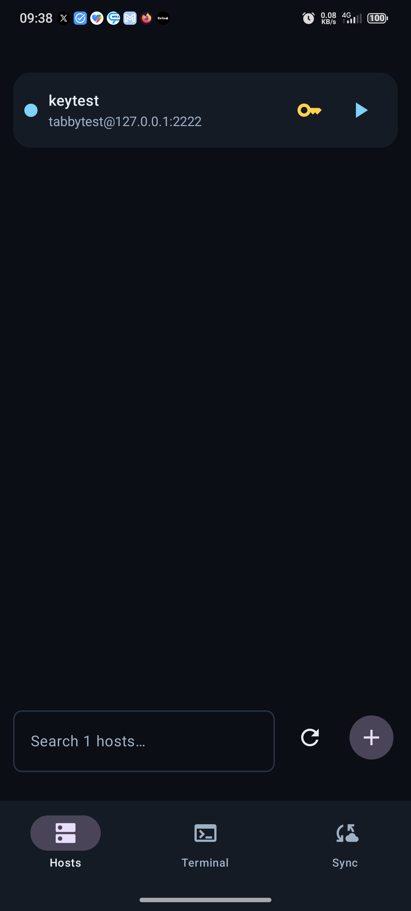
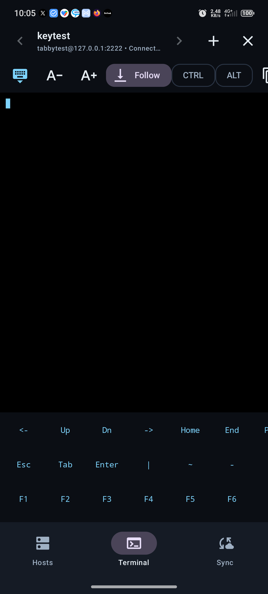
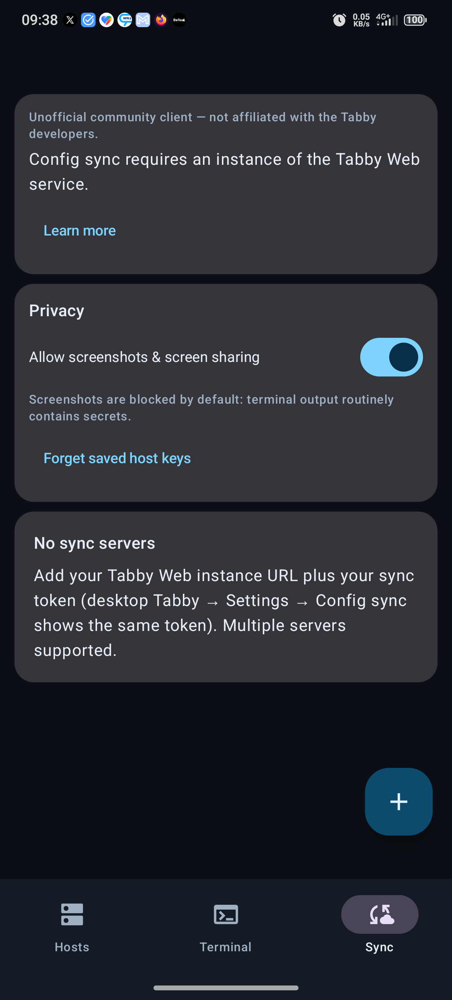

# Tabby Android — Termius-like companion for Tabby

> **Unofficial community client** (MIT, see [Legal](#legal)). There is no official
> Tabby app for Android (upstream closed it as `not_planned`), so this app syncs
> your Tabby SSH profiles via your own Tabby Web instance and connects with native SSH.

Tested on: **RedMagic 10 Pro / Android 16 (API 36)**, min Android 8.0 (API 26).

## Install

- **Easiest:** download `app-release.apk` from the
  [latest GitHub release](https://github.com/Michi4/tabby-android/releases) and install it.
- Or build it yourself: `./gradlew :app:assembleRelease` (release keystore stays
  on your machine, see below) or `./gradlew :app:assembleDebug` for a debug build.

Release signing: the release build expects a keystore at
`~/.android/tabby-keys/tabby-release.jks` with passwords in
`~/.gradle/gradle.properties` (`TABBY_RELEASE_STORE_PASSWORD`) or env vars.
Generate your own with `keytool -genkeypair` — **back it up**, updates must use
the same key. Never commit keystores or passwords (both live outside git).

## Features

- **Multiple sync servers**: each with name + host (your own Tabby Web instance) +
  secret token + chosen remote config id. Like desktop Tabby, the host starts empty:
  config sync requires an instance of the Tabby Web service
  (`Eugeny/tabby-web`, linked in-app via Learn more). Bare domains auto-upgrade
  to `https://`; plain `http://` is refused and bad TLS certs produce a clear error.
- **Bidirectional sync**: Pull (`GET`) downloads profiles; Upload (`PATCH /api/1/configs/{id}`,
  same call desktop Tabby makes) pushes them back. **Upload is always an explicit tap
  behind a confirm dialog - there is no auto-upload**, so the phone can never silently
  clobber your desktop config. Merge is non-destructive: unmanaged server entries,
  private-key refs, passwords, scripts and forwards are preserved; deletes propagate
  via tombstones. HTTPS enforced (no cleartext sync).
- **Hosts (Termius-like)**: bottom search, quick-connect `user@host:port`,
  nestable folders (incl. Termius `parentGroupId` imports), collapsible sections,
  pin hosts/folders to the top with manual ordering, manual add/edit/delete.
- **Terminal**: browser-style compact tabs, tap-to-type straight into SSH
  (system keyboard, no send button), sticky CTRL/ALT toggles, collapsible
  extended keys (symbols, arrows/Home/End/PgUp/PgDn/Ins/Del, F1–F12, combos),
  VT100/ANSI colors, cursor, follow-output, font size, copy line/screen, paste,
  clear, TOFU host-key accept dialog.
- **SSH keys**: import PEM or generate RSA-3072 in-app (public key shown for
  one-time server setup), per-profile key assignment. Keys never leave the device.
- **Secrets best practice**: sync tokens, passwords and key bytes in
  `EncryptedSharedPreferences` (Android Keystore); profiles/accounts/keys metadata
  in DataStore; session secrets additionally ephemeral in-memory per tab.
- Empty remote config (`{}`) handled gracefully with guidance.

## Screenshots

All screenshots use generic demo data (nothing real).

| Hosts | Terminal | Sync |
|---|---|---|
|  |  |  |

## Configure

1. Install the APK (see above).
2. Open **Sync** → **+** → Name: `Home`, Host: your Tabby Web instance URL (https),
   paste your **Secret sync token** (desktop Tabby → Settings → Config sync) →
   **Test & list configs** → pick config → **Save** → **Pull**.
   To send phone-side changes back, use **Upload** on the account card (confirm dialog first).
3. Open **Hosts** → tap a host → enter password (or pick a key) → **Connect**.
   Tap the terminal to type; CTRL/ALT stick for combos.

Never commit real tokens. The app never logs tokens/passwords/keys.

## Build & test

```bash
./gradlew :app:assembleDebug
./gradlew :app:testDebugUnitTest
./gradlew :app:lintDebug
```

48 unit tests, all runnable on JVM, no emulator needed: YAML parse/serialize/merge,
folder-tree (nesting, orphans, cycles), terminal buffer + key bytes, SSH key
generation, sync API (auth header, HTTPS rules, error mapping), quick-connect.

## Architecture

- Single-activity Compose + Navigation (Hosts / Terminal / Sync), Material3, edge-to-edge.
- `data/sync`: Retrofit API + `TabbyYamlParser` + `TabbyYamlSerializer` + `FolderTree` + `SyncRepository`.
- `data/local`: DataStore `ProfileRepository`, Keystore `SecureTokenStorage`.
- `data/ssh`: `SshConnection` (mwiede JSch, IO dispatcher) + `TerminalBuffer` (own VT subset) + `CtrlKeys` + `SshKeyManager`.
- `ui/state`: `ConnectionsViewModel`, `TerminalTabsViewModel` (survives rotation), `SyncAccountsViewModel`, `SshKeysViewModel`.

Known limits: no `ssh-ed25519` server host keys (JSch), no SFTP browser yet, no
agent forwarding yet.

## Legal

Unofficial community client, not affiliated with or endorsed by the Tabby developers.
Tabby and Tabby Web are MIT-licensed open source projects by Eugeny Pankov:
`Eugeny/tabby` (the desktop terminal) and `Eugeny/tabby-web` (the sync service
this app talks to). This app is MIT-licensed too (see LICENSE) and speaks the
same sync API as desktop Tabby — no Tabby artwork is bundled; the icon and
theme are original.
